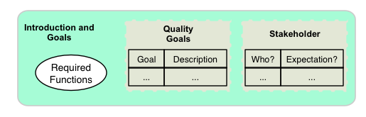
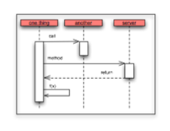
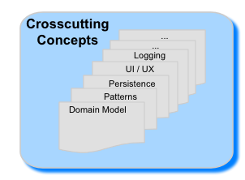

# About arc42
 
arc42, the Template for documentation of software and system
architecture.

By Dr. Gernot Starke, Dr. Peter Hruschka and contributors.

Template Revision: 7.0 EN (based on asciidoc), January 2017

© We acknowledge that this document uses material from the arc 42
architecture template, <http://www.arc42.de>. Created by Dr. Peter
Hruschka & Dr. Gernot Starke.

> **Note**
>
> This version of the template contains some help and explanations. It
> is used for familiarization with arc42 and the understanding of the
> concepts. For documentation of your own system you use better the
> *plain* version.  

## 1. Introduction and Goals 
Short description of the requirements, driving forces, extract (or abstract) of requirements. Top three (max five) quality goals for the architecture which have highest priority for the major stakeholders. A table of important stakeholders with their expectation regarding architecture.   

## 2. Architecture Constraints 
Anything that constrains teams in design and implementation decisions or decision about related processes. Can sometimes go beyond individual systems and are valid for whole organizations and companies.   

## 3. Context and scope 
Delimits your system from its (external) communication partners (neighboring systems and users). Specifies the external interfaces. Shown from a business/domain perspective (always) or a technical perspective (optional).   

## 4. Solution Strategy 
Summary of the fundamental decisions and solution strategies that shape the architecture. Can include technology, top-level decomposition, approaches to achieve top quality goals and relevant organizational decisions.   

## 5. Building Block View 
Static decomposition of the system, abstractions of source-code, shown as hierarchy of white boxes (containing black boxes), up to the appropriate level of detail.   

## 6. Runtime View 
Behavior of building blocks as scenarios, covering important use cases or features, interactions at critical external interfaces, operation and administration plus error and exception behavior.   

## 7. Deployment View 
Technical infrastructure with environments, computers, processors, topologies. Mapping of (software) building blocks to infrastructure elements.    

  
## 8. Crosscutting Concepts
Overall, principal regulations and solution approaches relevant in multiple parts (→ cross-cutting) of the system. Concepts are often related to multiple building blocks. Include different topics like domain models, architectur patterns and -styles, rules for using specific technology and inmplementation rules.  

## 9. Architecture Decisions 
Important, expensive, critical, large scale or risky architecture decisions including rationals.   

## 10. Quality Requirements 
Quality requirements as scenarios, with quality tree to provide high-level overview. The most important quality goals should have been described in section 1.2. (quality goals).     

## 11. Risks and Technical Debt 
Known technical risks or technical debt. What potential problems exist within or around the system? What does the development team feel miserable about?   

## 12. Glossary 
Important domain and technical terms that stakeholders use when discussing he system. Also: translation reference if you work in a multi-language environment.  
  
   